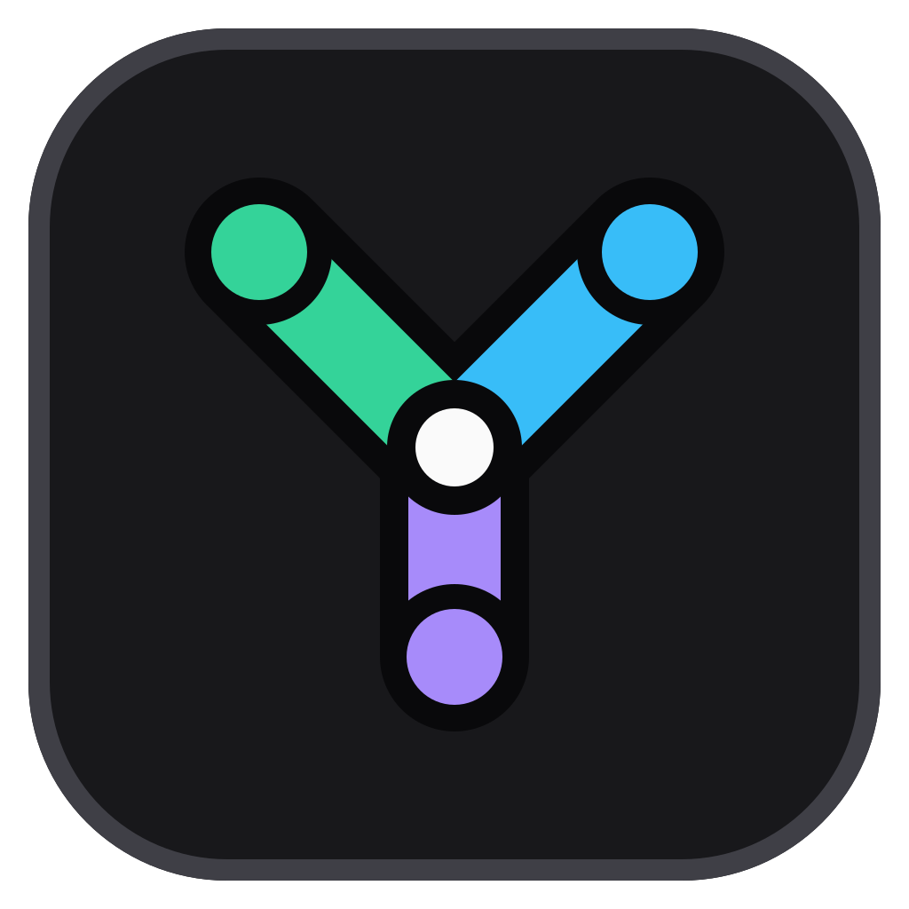

<p align="center">
  
</p>

# Yotta

[](https://github.com/yuelioi/yotta/actions/workflows/ci.yml)
[](https://github.com/yuelioi/yotta/releases)

Yotta 是一个本地优先的可视化自动化工作台。你可以用类型化节点图连接桌面窗口、Android 设备、浏览器、
HTTP 服务、文件和 AI 模型，把一次性的操作整理成可编辑、可调试、可复用的 Workflow。

根 [`VERSION`](VERSION) 当前为 **4.0.0**，也是第一个公开兼容基线。Windows 11 x64 是完整支持平台；
Linux 和 macOS 目前只提供预览级 host。项目采用限制商业使用的 source-available 许可证，不是 OSI
开源软件。

## 核心能力

- **Workflow 创作**：可视化节点图、类型化端口、子图、Snippet、变量和类型化 binding；支持导入、导出、批量管理
  与 revision 冲突保护。
- **运行与调试**：普通运行和断点调试共用同一编译器与执行器；Run 时间线展示节点、动作、状态和值，并可
  导出完整 JSON 进行诊断。
- **桌面与设备自动化**：Win32 窗口、后台截图和键鼠输入，Android ADB，以及 Chrome/Edge Browser CDP
  Target；Workflow 通过稳定 slot 使用本机配置，不保存临时窗口或设备会话。
- **视觉与数据处理**：模板匹配、颜色检测、二维码、图像比较，以及文件、JSON、HTTP、文本、集合、时间和
  状态等内置节点。
- **资源与素材库**：Workflow 可以携带 image、Macro 和 InputClip；本机 Asset Library 管理可跨 Workflow
  复用的 template、Macro 和 clip。
- **自动运行**：Schedule 支持每日/间隔、全局热键、daemon 注册时一次和纯手动触发，并可顺序提交多个
  Workflow 的启动请求；GUI、CLI 和 Schedule 最终进入同一条 Program 执行路径。
- **AI**：配置兼容的模型服务后，可在 Workflow 中生成文本或提取结构化数据，也可以生成待用户审阅的
  Workflow 修改提案。

## 工作方式

```text
Workflow Source ──> Compiler ──> immutable Program ──> Run / Debug
       │                                                   │
       └── graph、subgraph、resource 引用                 ├── Run timeline
                                                           └── providers + configured targets
```

Workflow 只保存可移植的图、逻辑 Target Slot 和资源引用。本机的应用路径、窗口选择、设备地址、HTTP 连接和
凭据留在当前设备设置中。Network、Application 与 Automation Target 由用户配置后按 Run 快照直接调用；
AI、文件、Blob、Stream 和隔离 guest 保留各自的资源边界。

Workflow Source 是唯一创作事实；GUI/Schedule 与 CLI 使用相同的 Application、Compiler 和 Runtime 组装路径，
但不同进程各自打开实例。MCP 与 AI authoring 只进入 Source/typed patch/compile/preview 边界，不维护第二套
执行逻辑。更详细的模型见[架构与代码地图](docs/architecture/README.md)。

## 平台状态

| Host / Target | 当前状态 |
| --- | --- |
| Windows 11 x64 host | 完整支持；正式构建、冻结 portable candidate 与原生自动化门禁均在 Windows 路径 |
| Linux x64 host | 预览；CI 测试选定的平台中立核心并编译 GUI，不提供发布包或 native GUI smoke |
| macOS arm64 host | 预览；CI 测试选定的平台中立核心并编译 GUI，签名、权限和 native smoke 尚未产品化 |
| Android ADB Target | adapter、创作配置与纵向测试已实现；发布结论仍需要已授权真机/模拟器 smoke |
| Browser CDP Target | adapter、创作配置与纵向测试已实现；发布结论仍需要隔离 Chrome/Edge profile smoke |

完整边界见[平台支持矩阵](docs/platform-support.md)。

## 从源码运行

版本要求以 [`go.mod`](go.mod) 和 [`frontend/package.json`](frontend/package.json) 为准。Windows 开发还需要
[Task](https://taskfile.dev/)、Wails v3 CLI；完整构建需要 Rust 和项目使用的 Windows 工具链。

```powershell
go install github.com/wailsapp/wails/v3/cmd/wails3@v3.0.0-beta.6
corepack enable
task dev
```

常用入口：

```powershell
task check       # 按当前 Git 变更运行增量门禁
task build       # 正式 Windows 构建
task package     # 在 clean worktree 中生成并验证冻结的发布候选
```

`task package` 会运行完整门禁、构建桌面程序与辅助进程、生成 manifest 和可复现 portable archive，并对冻结
产物执行 smoke。签名和公开发布步骤见 [RELEASING.md](RELEASING.md)。

## 文档

- [项目知识入口](docs/README.md)
- [Workflow 与创作模型](docs/product/workflows.md)
- [Target、Capability 与 Resource](docs/product/targets-and-resources.md)
- [Run、调试与 Schedule](docs/product/runs-and-schedules.md)
- [架构与代码地图](docs/architecture/README.md)
- [本地数据与恢复](docs/architecture/storage.md)
- [Headless CLI](docs/reference/cli.md)
- [兼容与迁移策略](docs/compatibility.md)
- [贡献指南](CONTRIBUTING.md)
- [安全策略](SECURITY.md)

## 许可证

当前 [LICENSE](LICENSE) 允许个人、教育和研究用途，但禁止未经授权的商业使用、营利分发、SaaS 和付费服务。
因此 Yotta 当前是 **source-available**，不是 OSI 定义的 open source。公开分发或贡献前请同时阅读
[发布就绪说明](docs/open-source-readiness.md)。
