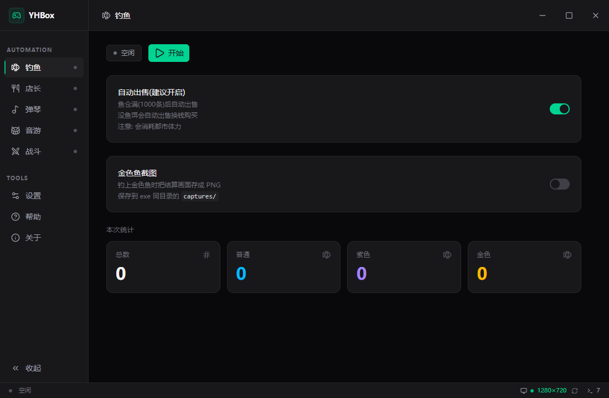
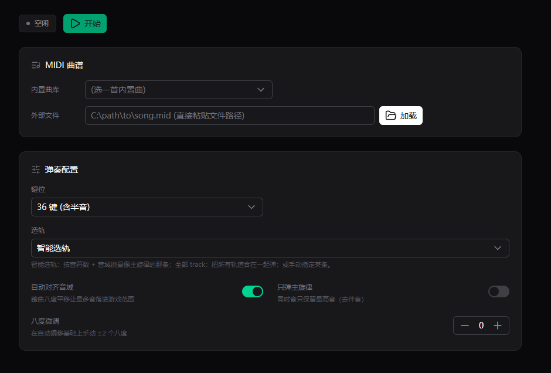

# Yotta

[](https://github.com/Yuelioi/Yotta/releases)

Windows 桌面工具，给《异环 / Neverness to Everness》提供后台自动化。**真后台**：不抢前台焦点、不动鼠标光标，挂机时可以正常用电脑写代码、看视频、刷网页。

|        自动钓鱼        |         自动弹琴         |
| :---------------------: | :----------------------: |
|  |  |

## 功能

- **自动钓鱼（fish）**：全自动抛竿 / 等待上钩 / 溜鱼 / 收杆 / 购买鱼饵 / 填充鱼饵 / 售卖鱼获 / 处理结算
- **锤子连点（cook）**：检测烹饪界面的锤子图标并自动点击
- **自动弹琴（piano）**：解析 MIDI 自动演奏，内置曲库 + 任意 `.mid`，36 键 / 21 键模式可切
- **自动音游 / 超强音（rhythm）**：识别 4 轨命中圈音符自动按 D/F/J/K，1080p / 720p 实测 100% 命中。算法借鉴自 [BnanZ0/ok-nte](https://github.com/BnanZ0/ok-nte)（亮度检测路线，比原本 HSV 颜色匹配的 95% 命中率高）
- **战斗 / 队伍切换（battle）**：全局热键一键切上阵队伍

## 快速开始

下载 `Yotta.exe`，双击运行，UAC 弹窗点"是"。

- **侧栏选择 bot** → 点 `开始` / `暂停` / `停止`
- **战斗** 启动全局热键后用 `Ctrl+Shift+1~6`（修饰键可换）切上阵队伍
- **设置** 切语言（zh/en）/ 截屏后端（auto/gdi/wgc/mock）/ 日志开关

设置自动保存到同目录 `settings.json`。

## 使用前确认

1. 游戏窗口不能最小化
2. 游戏分辨率 16:9 等比（**1920×1080 / 1280×720** 实测；其他可能也可用，需要补 ROI 标定）
3. 钓鱼前角色到达钓鱼点，屏幕右下角出现 **[F] 抛竿** 提示
4. 锤子连点前打开烹饪界面（**前台运行**，依赖前台截屏）
5. 弹琴前打开钢琴演奏界面 + 选 36 键 / 21 键模式
6. 切队伍前在主界面、无弹窗占用 `L` 键
7. 音游进入"超强音"曲目后再点开始

## 文档

- **用户**：本 README + 应用内"帮助"页
- **维护者 / 二次开发**：[docs/tech/](docs/tech/) — 每个 bot 一份技术文档 + 总体架构 + 开发指南（加新分辨率 / 加新语言 / 加新 bot）

## 从源码构建

需要 Go 1.25+、Node 22+、Rust（编 WGC 截屏 DLL）、wails3 CLI 和 [Task](https://taskfile.dev)。

```powershell
task build       # 一键编 frontend + Rust DLL + Go exe，产物在 bin/
task dev         # 开发模式（vite HMR + wails3 dev）
```

## 许可

[LICENSE](LICENSE)
